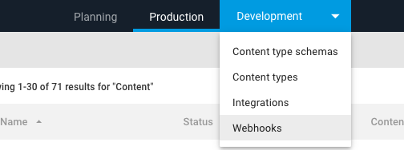
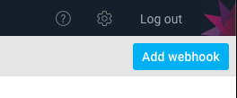
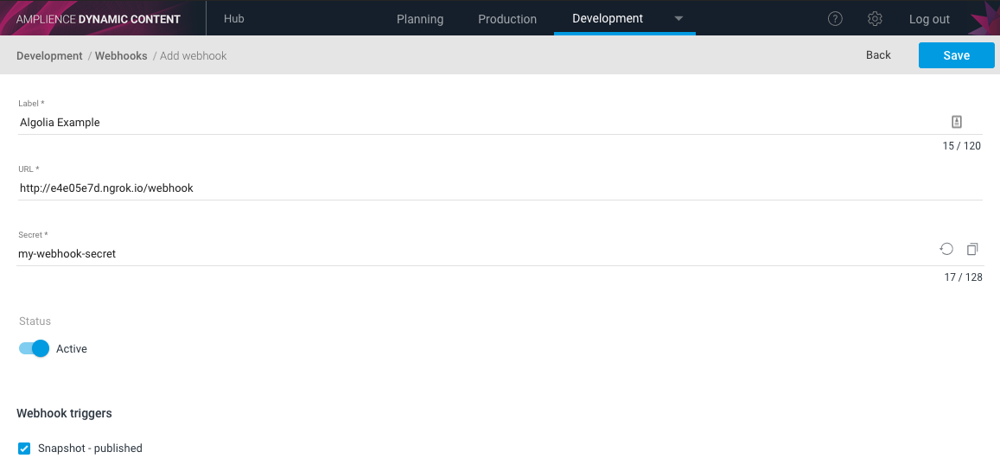

[](https://amplience.com/dynamic-content)

# dc-integrations-algolia

> A sample [Amplience Dynamic Content]((https://amplience.com/dynamic-content)) integration for [Algolia Search API](https://www.algolia.com/products/search/)


This project is a sample webhook integration that demonstrates how you can keep your Algolia Search index up-to-date with published content from Dynamic Content.

## _Warning_ 

* These following steps are just demonstrating how you can run this application for DEVELOPMENT purposes only.

* This application DOES NOT come with a warranty/support. We are not responsible for the outcome of this integration.

* DO NOT run this application in a production environment - this integration is a sample/example integration.

## Main Features

* Adds the top-level Dynamic Content Content-Item (keyed on the Content Item id) to your Algolia Search index when you publish a content graph
* Validates the Dynamic Content Webhook using a predefined secret

## Installation

Checkout this repo and install the dependencies via npm:

``` sh
npm install 
```

## Running in Development mode 

### 1. Configure your environment

Configuration values required to run the application should be saved in a `.env` file within the root of the project. Example is shown below:

```bash
DC_CLIENT_ID=my-dc-client-id
DC_CLIENT_SECRET=my-dc-secret
WEBHOOK_SECRET=dc-webhook-secret
ALGOLIA_APPLICATION_ID=my-app-id
ALGOLIA_API_KEY=my-api-key
ALGOLIA_INDEX_NAME=my-index-name
CONTENT_TYPE_WHITELIST=schema-id1;schema-id2;schema-id3
```

#### 1.1 Using a different Dynamic Content environment
You can override the Dynamic Content API and Amplience Auth URLs by defining these optional environment variables:
```bash
DC_API_URL=https://...
DC_AUTH_URL=https://...
```

### 2. Start the application
To run this application locally, run the following (default port is 3000)

```bash
npm run start
```

If you require this app to run on a different port, set the PORT environment variable

```bash
PORT=1337 npm run start 
``` 

### 3. Exposing your local port externally

For development purposes you can use the awesome [ngrok](https://ngrok.com/), which will give you a public URL for your webhook integration. **This is only to be used for demonstration/development purposes**

1. [Install & configure ngrok](https://ngrok.com/download)

2. Expose your chosen http port
    ```bash
    ngrok http 3000
    ```

### 4. Create a webhook subscription

1. Go to the Webhook management section within Dynamic Content ("Development" -> "Webhooks" from the menu) 
  
    
    
    _If this option is not available to you, please open an support ticket requesting Webhook access - [Amplience Support](https://support.amplience.com/)_
2. Click the "Add webhook" in the top right.

    

3. Enter & save your webhook.
    * For this integration the URL must end in "/webhook"
    * Your secret must match the one you defined in step 1.
    * You must select the "Snapshot - published" with Webhook trigger 

    


### 5. Publish a content item

Publishing a content item should now trigger your Algolia integration to be invoked. You should see something similar in your console:

```bash
  express:router dispatching POST /webhook +999ms
  express:router query  : /webhook +1ms
  express:router expressInit  : /webhook +1ms
  express:router router  : /webhook +1ms
  express:router dispatching POST /webhook +0ms
```

## Contributing

If you would like to contribute to this project, please follow our [contributing guide](./CONTRIBUTING.md).

## License

This software is licensed under the [Apache License, Version 2.0](http://www.apache.org/licenses/LICENSE-2.0),

Copyright 2019 Amplience

Licensed under the Apache License, Version 2.0 (the "License");
you may not use this file except in compliance with the License.
You may obtain a copy of the License at

    http://www.apache.org/licenses/LICENSE-2.0

Unless required by applicable law or agreed to in writing, software
distributed under the License is distributed on an "AS IS" BASIS,
WITHOUT WARRANTIES OR CONDITIONS OF ANY KIND, either express or implied.
See the License for the specific language governing permissions and
limitations under the License.
